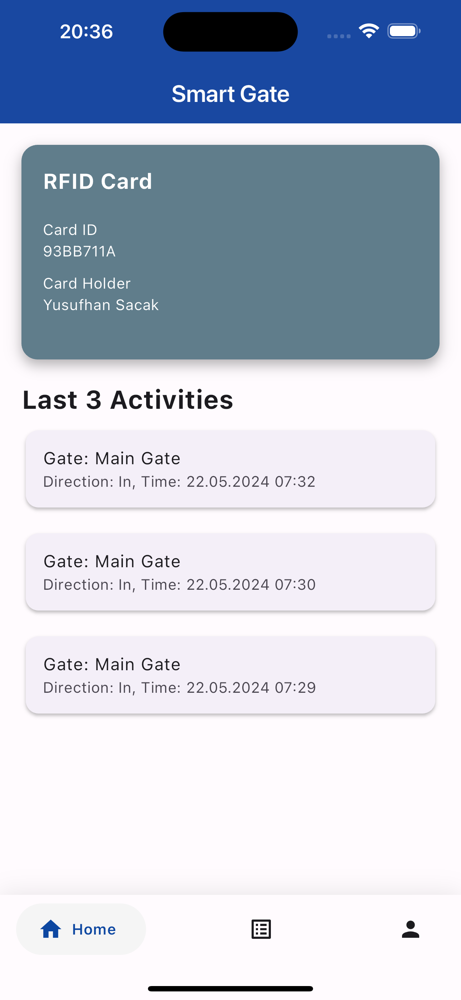

# RFID Based Access Control Mobile Application

This project is a Capstone Project for the Computer Engineering Department at Bahçeşehir University.

## Overview

The RFID Based Access Control mobile application is designed to manage and monitor access control systems using RFID technology. The application allows administrators to control and oversee access permissions for various secured areas, providing an efficient and secure method for access management.

## Features

- User Authentication: Secure login and authentication for administrators and users.
- RFID Tag Management: Add, update, and remove RFID tags.
- Access Logs: View logs of access attempts and approvals.
- User Management: Manage user profiles and access rights.
- Real-Time Notifications: Receive real-time notifications for access attempts.

# Screenshots

| Screenshot 1 | Screenshot 2 |
|--------------|--------------|
|  |  |
| Onboarding Screen 1 | Onboarding Screen 2 |
|  |  |
| Onboarding Screen 3 | Onboarding Screen 4 |
|  |  |
| Login Screen | Register Screen |
|  |  |
| Home Screen | Access Logs Screen |
|  |  |
| Profile Screen | Manage Access Screen |

## Technologies Used

### Frontend

- **Flutter**: Used for building the cross-platform mobile application.

### Backend

- **NodeJS**: Utilized for the server-side logic and API development.

### Database

- **MySQL**: Database used for storing user information, access logs, and RFID tag data.

### Prerequisites

- Flutter SDK
- NodeJS
- MySQL

## Contact

If you have any questions, feedback, or would like to connect, feel free to reach out to me.

- **Name:** Yusufhan Saçak
- **Email:** [yusufhan.sacak@bahcesehir.edu.tr](mailto:yusufhan.sacak@bahcesehir.edu.tr)
- **Medium:** [My Medium Profile](https://medium.com/@yusufhansacak)
- **Twitter:** [@0xSCK](https://twitter.com/0xSCK)
- **LinkedIn:** [Yusufhan Saçak](https://www.linkedin.com/in/yusufhansacak/)
- **Website:** [yusufhan.dev](https://yusufhan.dev/)

Feel free to contact me through any of the channels above. I'm open to collaborations and discussions related to Flutter development or any other projects.
